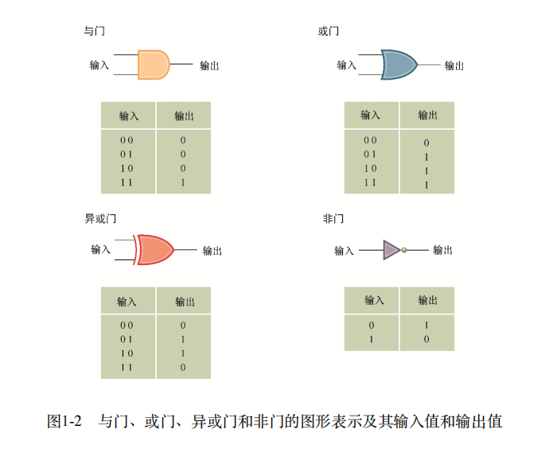

# 数据存储

## 位和位存储

- 在计算机内，所有信息是以 0 和 1 的模式编码的，数字称为位
- 位的存储和操作
  - 设定: 0 表示假、1 表示真
  - 布尔运算：位的操作
    - AND、OR、XOR
      - 输入一组值，得到第三个值
      - AND： 两个输入都是真才为真
      - OR: 两个输入都是假才为假
      - XOR：两个输入相同为假
    - NOT
      - 只有一个输入一个输出
      - 输入与输出值相反
- 门(逻辑门)
  - 功能: 给定一种布尔运算的输入值，可以得到该布尔运算的输出值
  - 布尔运算的硬件实现
    - 可以通过齿轮、继电器和光学设备实现
    - 现代计算机中的门通常由**晶体管**这种小型电路实现
  - 分类
    - 与门、或门、异或门、非门
      
  - 定位
    - 计算机最小的构建块
    - 由于门的存在，所以在程序设计语言中，布尔运算可以出现
- 触发器
  - 由门电路组成，计算机存储器的基本单元，可以产生 0 或 1 输出值的电路
  - 原理: 它的值会保持不变，直到另一个电路的脉冲信号使其变换为其他值,也就是说输出可以在外界刺激下记住 0 或 1 作为输出值
  - 计算机工程师不必知晓触发器实际使用的电路结构，只需要理解触发器的外部特征，这是一种抽象的体现
  - 使用场景
    - 存储二进制的方法
- 芯片
  - 通过超大规模集成技术将数百万个元件构造在一个半导体晶片上
  - 用于创建触发器及其控制电路 

- 十六进制记数法
  - 位模式也称为位串，长位串称为流，通常使用十六进制简写位串，一个十六进制表示位模式的 4 位
  - 公共前缀 0x 表示十六进制

## 主存储器

- 位存储器也称为主存储器，每个电路能够存储一个位
- 结构
  - 主存储器由存储单元组成，一个存储单元 8 位(一个字节)
  - 存储单元通常是行主序，也就是排成一行，左侧称为高位端，右侧称为低位端
    - 高位端的最左边一位称为最高有效位
    - 低位端的最左边一位称为最低有效位
  - 存储单元的区分是通过地址，地址是顺序排列的
  - 存储单元的读写操作是通过组合的其他电路实现的

## 海量存储器

- 包含磁盘、CD、DVD、磁带、闪存和固态

## 用位模式表示信息

- 文本的表示
  - 文本中每个字符被赋予唯一的位模式
  - ASCII
    - 使用长度为 7 的位模式表示大小写英文字母、标点符号、数字和控制信息
  - 扩展 ASCII
    - 使用长度为 8 的位模式表示
    - 额外的扩展主要针对西欧的语种设计
  - Unicode
    - ASCII 无法满足亚洲语言和东欧语言
    - 全球统一的字符集标准，每个字符对应唯一的数字编号(码点)
    - 码点
      - 使用十六进制表示，前缀 U+
      - 使用 21 位地址空间，U+0000 ~ U+10FFFF
      - 可以分为 17 个平面
        - 平面 0：BMP 常用字符
        - 平面 1~16：SMP
    - 编码
      - 存储码点
      - UTF-8
        - 1~4 字节
        - ASCII 1 字节
        - 中文 3 字节
        - 表情 4 字节
      - UTF-16
        - 2 或 4 字节
        - BMP 2 字节
        - SMP 4 字节
      - UTF-32
        - 4 字节
        - 直接存储码点
    - 大小端问题(TODO)
      - 面临问题：多字节数据在内存中存储顺序
      - 大端
        - 高位字节在低地址
        - 历史原因：Motorola 68000 用大端
      - 小端
        - 低位字节在低地址
        - 历史原因：Intel x86 用小端
      - 与字符编码关系
        - UTF-16/32 依赖字节序
        - BOM 作用：在文件头部添加标记 U+FEFF，帮助解析器识别字节序
        - UTF-16/32 可以使用大端或小端
        - UTF-8 无需 BOM
- 数值的表示
  - 通常使用二进制补码记数法的系统存储整数，使用浮点记数法表示分数
- 图像的表示
  - 位图
    - 将图像解释为一组点，每个点称为一个像素，对每个像素进行编码，图像就是这些编码的集合
    - 两种方式编码
      - RGB 编码
      - 使用亮度成分、蓝色色度和红色色度
  - 矢量图
    - 将图像描述为几何结构的结合
- 声音的表示
  - 编码方式：
    - 按有规律的时间间隔对声波的振幅采样，并记录所得到的值序列
      - 通过对采样频率的提高，可以最大限度的还原声音
    - MIDI
      - 乐器数字化接口，在合成器上编码产生音乐的指令

## 二进制系统

- 只使用 0 和 1 表示数值的方法
- 二进制记数法
  - 每个位置和一个量值相关联，最低位表示 1，向左依次递增 2 倍
- 二进制加法
  - 与十进制一致，区别在于逢 2 进 1
- 二进制分数
  - 小数点左侧是整数、右侧是小数，规则和二进制记数法一致

## 整数的存储

- 二进制补码记数法
  - 最左边符号位，1 表示负数，0 表示正数
  - 绝对值相同的正负只有种对应关系
    - 从右往左读，直到第一个二进制 1，它们都是相同的
    - 以这个 1 位分界线，左边的位模式互为补码
  - 加法
    - 所有参与的位模式都是一样，最高位进位截断
  - 优点
    - 有符号数的任意组合的加法，都可以使用相同的算法来完成，因而可以使用相同的电路来实现
- 余码记数法
  - 在确定使用模式的长度后，将最高有效位为 1 的二进制序列排列在数列中，表示 0
  - 其后的数字表示正数递增，之前的数字表示负数递减
  - 通常最高有效位表示的量级就是余码的具体数字，也称余几码

## 分数的存储

- 浮点记数法
  - 可以分为符号位、指数位和尾数位
  - 最高位为符号位，0 表示非负数、1 表示负数
  - 指数位
    - 位数表示余码数
  - 尾数位
    - 表示小数点右侧精度
    - 规范化形式：
      - 尾数域从二进制表示最左边的 1 开始填充
    - 超过规定范围就会截断，产生误差
  - 0 的浮点数表示为全 0 位模式

## 数据与程序设计

- 以 Python 为例

## 数据压缩

- 在保留基础信息的同时，缩小所涉及的数据的大小的行为
- 通用技术
  - 无损
    - 行程长度编码
    - 频率相关编码
  - 有损
    - 图像压缩
      - GIF
      - JPEG
      - TIFF
    - 音频和视频压缩
      - 运动图像专家组 MPEG
      - MP3

## 通信差错

- 通过编码技术来检测或校正
  - 奇偶校验位
  - 纠错码
